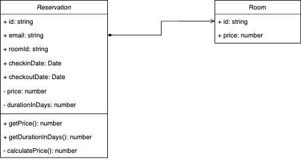

# SOLID + STRATEGY + TEMPLATE METHOD + TDD

Repositório para aplicar modelos UML com príncipios S.O.L.I.D, TDD e Design Patterns.



## Para teste:

```bash
npm i -D
docker compose up -d
touch .env.test
```

## Rode a migration/query.sql para usar com PostgresSQl:

```bash
psql -d postgres -f migration/query sql
```

## Preencha com os dados do seu banco local no .env.test

```
DB_USER=""
DB_PASSWORD=""
DB_HOST=""
DB_PORT=5432
```

## Rode:

```bash
npm run test
```
